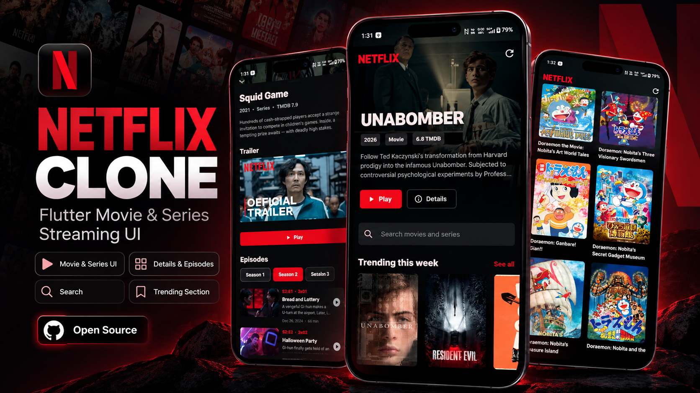

# Streamflix — Netflix Clone in Flutter

A Flutter movie & series streaming UI with Riverpod state management and live
TMDB metadata.



## Features

- **Home** — hero banner plus infinite horizontal rails for trending, now
  playing, popular, top rated, and Asian movie/series collections.
- **Details & Episodes** — synopsis, cast-style metadata, trailer, and a full
  season/episode breakdown.
- **Swipeable season selector** — swipe the season rail to move between seasons
  without leaving the details screen.
- **Search** — debounced TMDB search that pages in more results as you scroll.
- **Trending section** — a dedicated trending view reachable from the nav bar.
- **In-app trailer playback** — YouTube playback via `youtube_player_iframe`,
  with a sheet player for the full-screen experience.
- **Shimmer skeletons** — in-house `ShaderMask` shimmer placeholders for the
  first paint, posters, and later pages. No extra package required.
- **Offline fallback catalog** — if TMDB is unreachable, the app renders a small
  built-in catalog instead of an empty screen.
- **Dark, Netflix-inspired theme** defined in `lib/src/theme/app_theme.dart`.

## Stack

| Concern | Choice |
| --- | --- |
| State management | `flutter_riverpod` |
| Networking | `http` |
| Images | `cached_network_image` |
| Playback | `youtube_player_iframe`, `url_launcher` |
| Platform | Android (`com.panditfx.netflix`) |

## Getting started

Prerequisites: Flutter 3.47+ (stable) on the `stable` channel, an Android SDK,
and Xcode if you want to run on iOS.

```sh
git clone https://github.com/Ayushpanditmoto/Netflix-clone.git
cd Netflix-clone
flutter pub get
```

## Configuration

The app ships with a default TMDB key so the live home collections work out of
the box. To use your own key, pass it at build/run time with `--dart-define`:

```sh
flutter run --dart-define=TMDB_API_KEY=your_tmdb_key
```

> **Note:** the bundled fallback key is a development convenience and is
> rate-limited. Move your own key into `--dart-define` (or a
> `--dart-define-from-file`) before shipping a public build.

## Run

```sh
flutter run                                        # debug, on a connected device
flutter run --dart-define=TMDB_API_KEY=your_key    # with your own TMDB key
```

## Checks

```sh
flutter analyze
flutter test
flutter build web --dart-define=TMDB_API_KEY=your_tmdb_key
```

The test suite (25 tests) covers the TMDB repository and its paging, movie
sections, episode lists, and search paging.

## Release APK

Download the prebuilt release APK:

**[⬇ Download app-release.apk](https://github.com/Ayushpanditmoto/Netflix-clone/releases/latest)** —
*Releases → v1.0.0 → `app-release.apk`*

Or build it yourself:

```sh
flutter build apk --release --dart-define=TMDB_API_KEY=your_tmdb_key
```

The artifact is written to:

```text
build/app/outputs/flutter-apk/app-release.apk
```

To produce split APKs per ABI (smaller downloads), or an App Bundle for Play:

```sh
flutter build apk --release --split-per-abi
flutter build appbundle --release --dart-define=TMDB_API_KEY=your_tmdb_key
```

### Signing

`android/app/build.gradle.kts` currently signs release builds with the **debug
keystore** so that `flutter run --release` works out of the box. Before
publishing to Google Play, generate a real upload keystore and point the
release `signingConfig` at it:

```sh
keytool -genkey -v -keystore ~/upload-keystore.jks -keyalg RSA \
  -keysize 2048 -validity 10000 -alias upload
```

## Project structure

```text
lib/
  main.dart
  src/
    features/
      home/        home screen, section screen, providers
      player/      player screen, episode list, sheet player, trailer
    models/        movie, player source
    widgets/       movie tile, poster image, shimmer
    theme/         app theme
test/              repository, sections, episode list, search paging
```

## License

Released for educational and portfolio purposes. Netflix, TMDB, and all movie
artwork are trademarks of their respective owners. This project is not
affiliated with or endorsed by Netflix, Inc.

